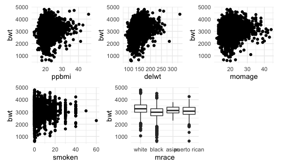
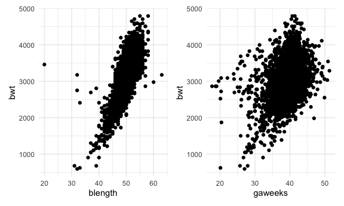
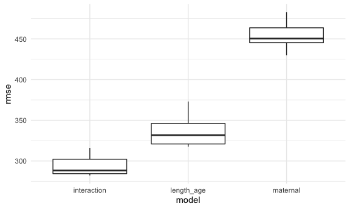
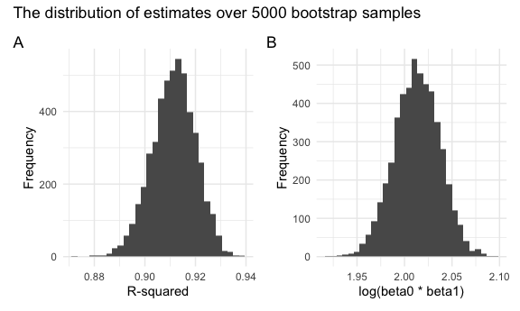

P8105 Homework 6
================
Heidi Lumish

## Problem 1: Birthweights

#### Import and clean the data

First we will convert all categorical variables to factor variables.

``` r
birthweight = read_csv("./data/birthweight.csv") %>%
  mutate(
    babysex = as.factor(babysex),
    frace = as.factor(frace),
    frace = fct_recode(frace, "white" = "1", "black" = "2", "asian" = "3", 
                     "puerto rican" = "4", "other" = "8"),
    malform = as.factor(malform),
    mrace = as.factor(mrace),
    mrace = fct_recode(mrace, "white" = "1", "black" = "2", "asian" = "3", 
                      "puerto rican" = "4")
  )
```

We can check for missing values using the following code, and we see
that there are no missing values:

``` r
colSums(is.na(birthweight))
```

    ##  babysex    bhead  blength      bwt    delwt  fincome    frace  gaweeks 
    ##        0        0        0        0        0        0        0        0 
    ##  malform menarche  mheight   momage    mrace   parity  pnumlbw  pnumsga 
    ##        0        0        0        0        0        0        0        0 
    ##    ppbmi     ppwt   smoken   wtgain 
    ##        0        0        0        0

#### Descriptive statistics

Next we will obtain descriptive statistics for the continuous variables
to assess for data errors.

``` r
multiple_func <- function(x) {
  
    if (is.numeric(x)) {

    min = min(x)
    max = max(x)
    mean = mean(x)
    sd = sd(x)
    
    output = c(min, max, mean, sd)
    
  return(output)
   
    }     
}

birthweight_numeric = birthweight %>% 
  select(-babysex, -frace, -malform, -mrace)

as.data.frame(apply(X = birthweight_numeric,
      FUN = multiple_func, 
      MARGIN = 2)) %>% 
  mutate(value = c("min", "max", "mean", "sd"))%>%
  relocate(value) %>% 
  knitr::kable()
```

| value |     bhead |   blength |       bwt |     delwt |  fincome |   gaweeks | menarche |   mheight |    momage |    parity | pnumlbw | pnumsga |    ppbmi |      ppwt |    smoken |    wtgain |
|:------|----------:|----------:|----------:|----------:|---------:|----------:|---------:|----------:|----------:|----------:|--------:|--------:|---------:|----------:|----------:|----------:|
| min   | 21.000000 | 20.000000 |  595.0000 |  86.00000 |  0.00000 | 17.700001 |  0.00000 | 48.000000 | 12.000000 | 0.0000000 |       0 |       0 | 13.07137 |  70.00000 |  0.000000 | -46.00000 |
| max   | 41.000000 | 63.000000 | 4791.0000 | 334.00000 | 96.00000 | 51.299999 | 19.00000 | 77.000000 | 44.000000 | 6.0000000 |       0 |       0 | 46.09639 | 287.00000 | 60.000000 |  89.00000 |
| mean  | 33.650852 | 49.750576 | 3114.4040 | 145.57209 | 44.10525 | 39.426255 | 12.51428 | 63.493091 | 20.299171 | 0.0023031 |       0 |       0 | 21.57037 | 123.49056 |  4.145181 |  22.08153 |
| sd    |  1.620581 |  2.723403 |  512.1541 |  22.20781 | 25.97568 |  3.154538 |  1.47767 |  2.656452 |  3.877899 | 0.1029142 |       0 |       0 |  3.18211 |  20.16127 |  7.407550 |  10.94451 |

From the above output, we see that the minimum value for menarche is 0,
which is not possible. Therefore, we will exclude menarche = 0.

``` r
birthweight = birthweight %>% 
  filter(menarche != 0)

birthweight %>% 
  summarize(min = min(menarche))
```

    ## # A tibble: 1 × 1
    ##     min
    ##   <dbl>
    ## 1     5

Age 5 is still improbable as an age of menarche, so we will exclude this
observation as well.

``` r
birthweight = birthweight %>% 
  filter(menarche != 5)
```

#### Build a regression model

Next we will build a regression model for birthweight, based on the
hypothesis that maternal factors affect the infant’s birthweight.
Therefore, we will test the following variables:

-   Mother’s pre-pregnancy BMI (ppbmi)
-   Mother’s race (mrace)
-   Mother’s weight at delivery (delwt)
-   Mother’s age at delivery (momage)
-   Mother’s age at menarche (menarche)
-   Cigarette smoking during pregnancy (smoken)

First, we will create plots to assess the relationship between each of
the variables and the outcome of interest (birthweight).

``` r
ppbmi_plot = birthweight %>% 
  ggplot(aes(x = ppbmi, y = bwt)) + 
  geom_point()

delwt_plot = birthweight %>% 
  ggplot(aes(x = delwt, y = bwt)) + 
  geom_point()

momage_plot = birthweight %>% 
  ggplot(aes(x = momage, y = bwt)) + 
  geom_point()

menarche_plot = birthweight %>% 
  ggplot(aes(x = menarche, y = bwt)) + 
  geom_point()

smoken_plot = birthweight %>% 
  ggplot(aes(x = smoken, y = bwt)) + 
  geom_point()

mrace_plot = birthweight %>% 
  ggplot(aes(x = mrace, y = bwt)) + 
  geom_boxplot()

(ppbmi_plot + delwt_plot + momage_plot) / (smoken_plot + mrace_plot + plot_spacer())
```



Next, we will fit the linear model for maternal factors and extract the
intercept and coefficients, with their p-values, using ‘broom::tidy’.

``` r
maternal_model = lm(bwt ~ ppbmi + mrace + delwt + momage + menarche + smoken, data = birthweight)

maternal_model %>%
  broom::tidy() %>% 
  select(term, estimate, p.value) %>% 
  knitr::kable(digits = 3)
```

| term              | estimate | p.value |
|:------------------|---------:|--------:|
| (Intercept)       | 2575.990 |   0.000 |
| ppbmi             |  -34.555 |   0.000 |
| mraceblack        | -340.626 |   0.000 |
| mraceasian        |  -64.670 |   0.360 |
| mracepuerto rican | -129.631 |   0.000 |
| delwt             |   10.377 |   0.000 |
| momage            |    3.216 |   0.100 |
| menarche          |   -6.703 |   0.166 |
| smoken            |  -12.181 |   0.000 |

We can see that all of the coefficients are statistically significant
except for mrace3 and menarche. The coefficients for pre-pregnancy BMI,
Asian maternal race, Puerto Rican maternal race, and average number of
cigarettes smoked are all negative, suggesting that an increase in BMI
or number of cigarettes smoked, or having an Asian or Puerto Rican
mother is associated with a statistically significant decrease in infant
birthweight. By contrast, the coefficients for mother’s weight at
delivery and mother’s age are positive, suggesting that in increase in
each of these is associated with a statistically significant increase in
infant birthweight.

Here we create a plot of the model residuals against the fitted values.

``` r
birthweight %>% 
  add_residuals(maternal_model) %>% 
  add_predictions(maternal_model) %>% 
  ggplot(aes(x = pred, y = resid)) +
  geom_point()
```


#### Compare to two other models

Now we will compare the above model looking at the association between
maternal factors and birthweight with two other models.

##### Length and gestational age

The first model will include only length at birth and gestational age as
predictors. From the scatterplots below, we see that each variable
appears to have an overall linear relationship with birthweight.

``` r
blength_plot = birthweight %>% 
  ggplot(aes(x = blength, y = bwt)) + 
  geom_point()

gaweeks_plot = birthweight %>% 
  ggplot(aes(x = gaweeks, y = bwt)) + 
  geom_point()

blength_plot + gaweeks_plot
```



Next we will build the model and extract the coefficients.

``` r
length_age_model = lm(bwt ~ blength + gaweeks, data = birthweight)

length_age_model %>%
  broom::tidy() %>% 
  select(term, estimate, p.value) %>% 
  knitr::kable(digits = 3)
```

| term        |  estimate | p.value |
|:------------|----------:|--------:|
| (Intercept) | -4347.361 |       0 |
| blength     |   128.551 |       0 |
| gaweeks     |    27.045 |       0 |

We can see that both birth length and gestational age in weeks have a
statistically significant positive relationship with birthweight.

##### Interaction model

Next we will build a model using head circumference, length, sex, and
all interactions between these.

``` r
interaction_model = lm(bwt ~ bhead + blength + babysex +
                         bhead * blength + bhead * babysex + blength * babysex,
                       data = birthweight)

interaction_model %>%
  broom::tidy() %>% 
  select(term, estimate, p.value) %>% 
  knitr::kable(digits = 3)
```

| term             |  estimate | p.value |
|:-----------------|----------:|--------:|
| (Intercept)      | -3774.162 |   0.000 |
| bhead            |    79.681 |   0.002 |
| blength          |    31.632 |   0.076 |
| babysex2         |   261.968 |   0.186 |
| bhead:blength    |     1.557 |   0.003 |
| bhead:babysex2   |   -12.599 |   0.074 |
| blength:babysex2 |     4.130 |   0.322 |

Based on a significance level of p &lt; 0.05, we can see that the only
significant predictor of birthweight in this model is birth head
circumference. The interaction term between head circumference and
length at birth is also statistically significant.

#### Cross validation

Now we will use cross-validation to compare the three models

``` r
cv_df = 
  crossv_mc(birthweight, 10) %>% 
  mutate(
    train = map(train, as_tibble),
    test = map(test, as_tibble)
  )

cv_df = cv_df %>% 
  mutate(
    maternal_mod = map(.x = train, ~lm(bwt ~ ppbmi + mrace + delwt + momage + menarche + smoken, data = .x)),
    length_age_mod = map(.x = train, ~lm(bwt ~ blength + gaweeks, data = .x)),
    interaction_mod = map(.x = train, ~lm(bwt ~ bhead + blength + babysex +
                         bhead * blength + bhead * babysex + blength * babysex, data = .x))
  ) %>%
  mutate(
    rmse_maternal = map2_dbl(.x = maternal_mod, .y = test, ~rmse(model = .x, data = .y)),
    rmse_length_age = map2_dbl(.x = length_age_mod, .y = test, ~rmse(model = .x, data = .y)),
    rmse_interaction = map2_dbl(.x = interaction_mod, .y = test, ~rmse(model = .x, data = .y))
  )
```

We will examine the output of the cross validation using a box plot.

``` r
cv_df %>% 
  select(starts_with("rmse")) %>% 
  pivot_longer(
    rmse_maternal:rmse_interaction,
    names_to = "model",
    values_to = "rmse",
    names_prefix = "rmse_"
  ) %>% 
  ggplot(aes(x = model, y = rmse)) +
  geom_boxplot()
```



From the boxplots, we can see that across 100 testing and training
datasets, the third model (“interaction model”) had the lowest RMSE and
is therefore the most optimal model.

## Problem 2: Central Park Weather Data

#### Download the data

First we will import the Central Park weather data from 2017.

``` r
weather_df = 
  rnoaa::meteo_pull_monitors(
    c("USW00094728"),
    var = c("PRCP", "TMIN", "TMAX"), 
    date_min = "2017-01-01",
    date_max = "2017-12-31") %>%
  mutate(
    name = "CentralPark_NY",
    tmin = tmin / 10,
    tmax = tmax / 10) %>%
  select(name, id, everything())
```

We will create a simple linear regression with tmax as the response and
tmin as the predictor. We will look at the distributions of predicted
r-squared and log(beta\_0 \* beta\_1).

``` r
bootstrap_weather =
  weather_df %>% 
  sample_frac(size = 1, replace = TRUE) %>% 
  arrange(tmin)

lm(tmax ~ tmin, data = bootstrap_weather)
```

    ## 
    ## Call:
    ## lm(formula = tmax ~ tmin, data = bootstrap_weather)
    ## 
    ## Coefficients:
    ## (Intercept)         tmin  
    ##       7.343        1.043

Now we will generate 5000 bootstrap samples.

``` r
bootstrap_weather_df =
  weather_df %>% 
  bootstrap(n = 5000, id = "strap_number")
```

Next we will run the linear model on the 5000 bootstrap samples to
generate the estimates.

``` r
bootstrap_results =
  bootstrap_weather_df %>% 
  mutate(
    models = map(.x = strap, ~lm(tmax ~ tmin, data = .x)),
    results = map(models, broom::tidy),
    results2 = map(models, broom::glance)
  ) %>% 
  select(strap_number, results, results2) %>% 
  unnest(results2) %>% 
  select(strap_number, results, r.squared) %>%
  unnest(results) %>% 
  select(strap_number, term, estimate, r.squared) %>%
  pivot_wider(
    names_from = "term",
    values_from = "estimate"
  ) %>% 
  janitor::clean_names() %>% 
  mutate(
    beta0_beta1 = log(intercept * tmin)
  )
```

We will then plot distribution of the two estimates. We can see that
both distributions are normally distributed. The estimates in panel A
for R-squared center around 0.915 and the estimates in panel B for
log(beta0 \* beta1) centers around 2.02.

``` r
r_squared_histo =
  bootstrap_results %>% 
  ggplot(aes(x = r_squared)) +
  geom_histogram() +
  labs(x = "R-squared",
      y = "Frequency")

beta0_beta1_histo = bootstrap_results %>% 
  ggplot(aes(x = beta0_beta1)) +
  geom_histogram() + 
  labs(x = "log(beta0 * beta1)", 
      y = "Frequency")

estimates = r_squared_histo + beta0_beta1_histo

estimates + plot_annotation(
  title = 'The distribution of estimates over 5000 bootstrap samples',
  tag_levels = 'A'
)
```

    ## `stat_bin()` using `bins = 30`. Pick better value with `binwidth`.
    ## `stat_bin()` using `bins = 30`. Pick better value with `binwidth`.



Now we will determine the 95% confidence interval for each estimate.

``` r
bootstrap_results %>% 
  summarize(
    ci_lower_r2 = round(quantile(r_squared, 0.025), 2), 
    ci_upper_r2 = round(quantile(r_squared, 0.975), 2),
    ci_lower_b0b1 = round(quantile(beta0_beta1, 0.025), 2), 
    ci_upper_b0b1 = round(quantile(beta0_beta1, 0.975), 2),
    ) %>% 
  unite("R-squared CI", ci_lower_r2, ci_upper_r2, sep = ", ") %>% 
  unite("log(beta_0*beta_1) CI", ci_lower_b0b1, ci_upper_b0b1, sep = ", ") %>%
  knitr::kable(title = "95% Confidence Intervals")
```

| R-squared CI | log(beta\_0\*beta\_1) CI |
|:-------------|:-------------------------|
| 0.89, 0.93   | 1.97, 2.06               |
