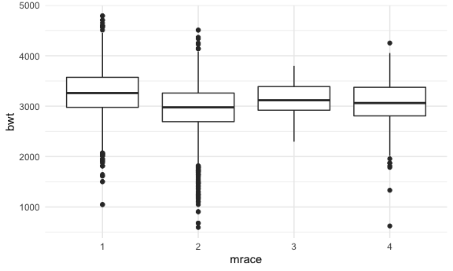
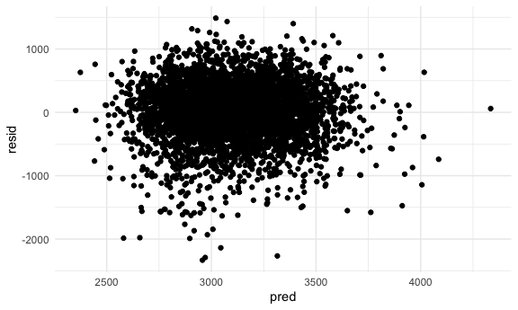
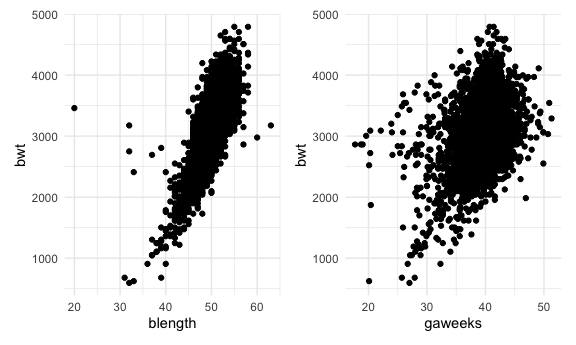
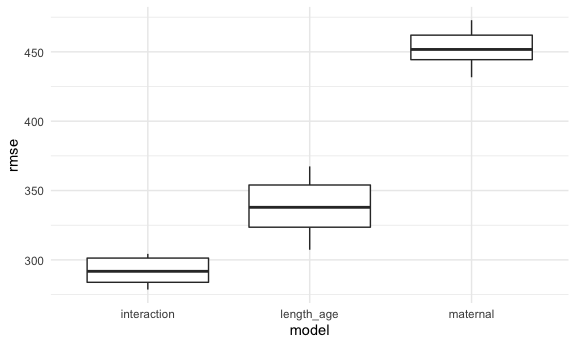

P8105 Homework 6
================
Heidi Lumish

## Problem 1

#### Import and clean the data

First we will convert all categorical variables to factor variables.

``` r
birthweight = read_csv("./data/birthweight.csv") %>%
  mutate(
    babysex = as.factor(babysex),
    frace = as.factor(frace),
    malform = as.factor(malform),
    mrace = as.factor(mrace)
  )
```

    ## Rows: 4342 Columns: 20

    ## ── Column specification ────────────────────────────────────────────────────────
    ## Delimiter: ","
    ## dbl (20): babysex, bhead, blength, bwt, delwt, fincome, frace, gaweeks, malf...

    ## 
    ## ℹ Use `spec()` to retrieve the full column specification for this data.
    ## ℹ Specify the column types or set `show_col_types = FALSE` to quiet this message.

We can check for missing values using the following code, and we see
that there are no missing values:

``` r
colSums(is.na(birthweight))
```

    ##  babysex    bhead  blength      bwt    delwt  fincome    frace  gaweeks 
    ##        0        0        0        0        0        0        0        0 
    ##  malform menarche  mheight   momage    mrace   parity  pnumlbw  pnumsga 
    ##        0        0        0        0        0        0        0        0 
    ##    ppbmi     ppwt   smoken   wtgain 
    ##        0        0        0        0

str(birthweight)

Descriptive statistics

``` r
multiple_func <- function(x) {
  
    if (is.numeric(x)) {

    min = min(x)
    max = max(x)
    mean = mean(x)
    sd = sd(x)
    
    output_df = 
    tibble(
      min = min,
      max = max,
      mean = mean,
      sd = sd)

  return(output_df)
   
    }     
}

sapply(birthweight, multiple_func)
```

    ## $babysex
    ## NULL
    ## 
    ## $bhead
    ## # A tibble: 1 × 4
    ##     min   max  mean    sd
    ##   <dbl> <dbl> <dbl> <dbl>
    ## 1    21    41  33.7  1.62
    ## 
    ## $blength
    ## # A tibble: 1 × 4
    ##     min   max  mean    sd
    ##   <dbl> <dbl> <dbl> <dbl>
    ## 1    20    63  49.8  2.72
    ## 
    ## $bwt
    ## # A tibble: 1 × 4
    ##     min   max  mean    sd
    ##   <dbl> <dbl> <dbl> <dbl>
    ## 1   595  4791 3114.  512.
    ## 
    ## $delwt
    ## # A tibble: 1 × 4
    ##     min   max  mean    sd
    ##   <dbl> <dbl> <dbl> <dbl>
    ## 1    86   334  146.  22.2
    ## 
    ## $fincome
    ## # A tibble: 1 × 4
    ##     min   max  mean    sd
    ##   <dbl> <dbl> <dbl> <dbl>
    ## 1     0    96  44.1  26.0
    ## 
    ## $frace
    ## NULL
    ## 
    ## $gaweeks
    ## # A tibble: 1 × 4
    ##     min   max  mean    sd
    ##   <dbl> <dbl> <dbl> <dbl>
    ## 1  17.7  51.3  39.4  3.15
    ## 
    ## $malform
    ## NULL
    ## 
    ## $menarche
    ## # A tibble: 1 × 4
    ##     min   max  mean    sd
    ##   <dbl> <dbl> <dbl> <dbl>
    ## 1     0    19  12.5  1.48
    ## 
    ## $mheight
    ## # A tibble: 1 × 4
    ##     min   max  mean    sd
    ##   <dbl> <dbl> <dbl> <dbl>
    ## 1    48    77  63.5  2.66
    ## 
    ## $momage
    ## # A tibble: 1 × 4
    ##     min   max  mean    sd
    ##   <dbl> <dbl> <dbl> <dbl>
    ## 1    12    44  20.3  3.88
    ## 
    ## $mrace
    ## NULL
    ## 
    ## $parity
    ## # A tibble: 1 × 4
    ##     min   max    mean    sd
    ##   <dbl> <dbl>   <dbl> <dbl>
    ## 1     0     6 0.00230 0.103
    ## 
    ## $pnumlbw
    ## # A tibble: 1 × 4
    ##     min   max  mean    sd
    ##   <dbl> <dbl> <dbl> <dbl>
    ## 1     0     0     0     0
    ## 
    ## $pnumsga
    ## # A tibble: 1 × 4
    ##     min   max  mean    sd
    ##   <dbl> <dbl> <dbl> <dbl>
    ## 1     0     0     0     0
    ## 
    ## $ppbmi
    ## # A tibble: 1 × 4
    ##     min   max  mean    sd
    ##   <dbl> <dbl> <dbl> <dbl>
    ## 1  13.1  46.1  21.6  3.18
    ## 
    ## $ppwt
    ## # A tibble: 1 × 4
    ##     min   max  mean    sd
    ##   <dbl> <dbl> <dbl> <dbl>
    ## 1    70   287  123.  20.2
    ## 
    ## $smoken
    ## # A tibble: 1 × 4
    ##     min   max  mean    sd
    ##   <dbl> <dbl> <dbl> <dbl>
    ## 1     0    60  4.15  7.41
    ## 
    ## $wtgain
    ## # A tibble: 1 × 4
    ##     min   max  mean    sd
    ##   <dbl> <dbl> <dbl> <dbl>
    ## 1   -46    89  22.1  10.9

Menarche should not be 0

``` r
birthweight %>% 
  filter(menarche == 0)
```

    ## # A tibble: 1 × 20
    ##   babysex bhead blength   bwt delwt fincome frace gaweeks malform menarche
    ##   <fct>   <dbl>   <dbl> <dbl> <dbl>   <dbl> <fct>   <dbl> <fct>      <dbl>
    ## 1 2          33      46  2466   138      25 2        34.6 0              0
    ## # … with 10 more variables: mheight <dbl>, momage <dbl>, mrace <fct>,
    ## #   parity <dbl>, pnumlbw <dbl>, pnumsga <dbl>, ppbmi <dbl>, ppwt <dbl>,
    ## #   smoken <dbl>, wtgain <dbl>

#### Build a regression model

Propose a regression model for birthweight. This model may be based on a
hypothesized structure for the factors that underly birthweight, on a
data-driven model-building process, or a combination of the two.
Describe your modeling process and show a plot of model residuals
against fitted values – use add\_predictions and add\_residuals in
making this plot.

Hypothesis: Maternal factors affect infant’s birthweight

Variables to test: - Mother’s pre-pregnancy BMI (ppbmi) - Mother’s race
(mrace) - Mother’s weight at delivery (delwt) - Mother’s age at delivery
(momage) - Mother’s age at menarche (menarche) - Cigarette smoking
during pregnancy (smoken).

Plots

``` r
scatterplotMatrix(~bwt + ppbmi + delwt + momage + menarche + smoken, data = birthweight)
```


``` r
birthweight %>% 
  ggplot(aes(x = mrace, y = bwt)) + 
  geom_boxplot()
```



Fitting the linear model

``` r
maternal_model = lm(bwt ~ ppbmi + mrace + delwt + momage + menarche + smoken, data = birthweight)

maternal_model %>%
  broom::tidy() %>% 
  select(term, estimate, p.value) %>% 
  knitr::kable(digits = 3)
```

| term        | estimate | p.value |
|:------------|---------:|--------:|
| (Intercept) | 2565.211 |   0.000 |
| ppbmi       |  -34.405 |   0.000 |
| mrace2      | -340.871 |   0.000 |
| mrace3      |  -65.193 |   0.356 |
| mrace4      | -129.785 |   0.000 |
| delwt       |   10.368 |   0.000 |
| momage      |    3.212 |   0.100 |
| menarche    |   -5.986 |   0.211 |
| smoken      |  -12.170 |   0.000 |

Show a plot of model residuals against fitted values – use
add\_predictions and add\_residuals in making this plot.

``` r
birthweight %>% 
  add_residuals(maternal_model) %>% 
  add_predictions(maternal_model) %>% 
  ggplot(aes(x = pred, y = resid)) +
  geom_point()
```



#### Compare to two other models

##### Length and gestational age

Scatterplots

``` r
blength_plot = birthweight %>% 
  ggplot(aes(x = blength, y = bwt)) + 
  geom_point()

gaweeks_plot = birthweight %>% 
  ggplot(aes(x = gaweeks, y = bwt)) + 
  geom_point()

blength_plot + gaweeks_plot
```



``` r
length_age_model = lm(bwt ~ blength + gaweeks, data = birthweight)

length_age_model %>%
  broom::tidy() %>% 
  select(term, estimate, p.value) %>% 
  knitr::kable(digits = 3)
```

| term        |  estimate | p.value |
|:------------|----------:|--------:|
| (Intercept) | -4347.667 |       0 |
| blength     |   128.556 |       0 |
| gaweeks     |    27.047 |       0 |

##### Interaction model

``` r
interaction_model = lm(bwt ~ bhead + blength + babysex +
                         bhead * blength + bhead * babysex + blength * babysex,
                       data = birthweight)

interaction_model %>%
  broom::tidy() %>% 
  select(term, estimate, p.value) %>% 
  knitr::kable(digits = 3)
```

| term             |  estimate | p.value |
|:-----------------|----------:|--------:|
| (Intercept)      | -3768.305 |   0.000 |
| bhead            |    79.506 |   0.002 |
| blength          |    31.511 |   0.077 |
| babysex2         |   259.978 |   0.189 |
| bhead:blength    |     1.561 |   0.003 |
| bhead:babysex2   |   -12.662 |   0.072 |
| blength:babysex2 |     4.211 |   0.313 |

#### Cross validation

Now we will cross-validation to compare the models

``` r
cv_df = 
  crossv_mc(birthweight, 10) %>% 
  mutate(
    train = map(train, as_tibble),
    test = map(test, as_tibble)
  )

cv_df = cv_df %>% 
  mutate(
    maternal_mod = map(.x = train, ~lm(bwt ~ ppbmi + mrace + delwt + momage + menarche + smoken, data = .x)),
    length_age_mod = map(.x = train, ~lm(bwt ~ blength + gaweeks, data = .x)),
    interaction_mod = map(.x = train, ~lm(bwt ~ bhead + blength + babysex +
                         bhead * blength + bhead * babysex + blength * babysex, data = .x))
  ) %>%
  mutate(
    rmse_maternal = map2_dbl(.x = maternal_mod, .y = test, ~rmse(model = .x, data = .y)),
    rmse_length_age = map2_dbl(.x = length_age_mod, .y = test, ~rmse(model = .x, data = .y)),
    rmse_interaction = map2_dbl(.x = interaction_mod, .y = test, ~rmse(model = .x, data = .y))
  )
```

Look at the output Ideally using a boxplot

``` r
cv_df %>% 
  select(starts_with("rmse")) %>% 
  pivot_longer(
    rmse_maternal:rmse_interaction,
    names_to = "model",
    values_to = "rmse",
    names_prefix = "rmse_"
  ) %>% 
  ggplot(aes(x = model, y = rmse)) +
  geom_boxplot()
```



Boxplots help us understand across 100 testing and training datasets,
which one had the lowest rmse.
